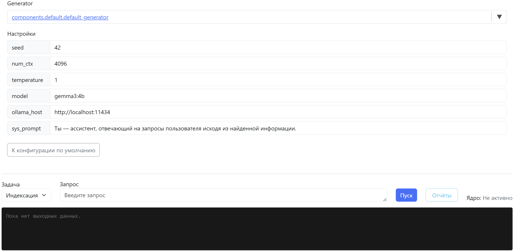

# rag

## Описание

Проект для ВКРБ "Система генерации текста на основе RAG подхода". Цель разработки системы – предоставление продвинутым пользователям возможности локального использования гибко настраиваемого программного модуля с открытым исходным кодом для прототипирования RAG конвейеров.

## Запуск

Пока проект на стадии доработки, если менеджер пакетов uv, запуск производится следующим образом:  
```uv run .\manage.py runserver --noreload```  
В случае активного виртуального окружения:  
```python .\manage.py runserver --noreload```  
В терминале будет вывод с url интерфейса, например:  
```http://127.0.0.1:8000/```

## Краткий туториал по интерфейсу

### Подключение

Ввести в адресную строку URL веб-интерфейса и нажать Enter:  
  
Страница должна выглядеть следующим образом:  


### Описание элементов страницы

Слева расположен перечень RAG конвейеров:  
  
В нём можно выбрать существующий или создать новый конвейер:  
  
Большую часть экрана занимает окно конфигурации выбранного RAG конвейера:  
  
В окнах создания и конфигурации конвейеров можно выбирать существующие или создавать новые компоненты:  
  
При создании нового будет предложен выбор существующего python модуля или создание нового:  
  
При выборе существующего откроется редактор существующего модуля, при создании нового, после ввода названия, откроется редактор с сгенерированным пресетом нового модуля с новым компонентом:  
  
  
После выбора созданного компонента можно менять параметры через интерфейс (те, что имеют в коде значения по умолчанию):  
  
К редактированию кода компонента всегда можно вернуться нажатием по ссылке:  
  
Под окном конфигурации конвейера расположено окно запуска задач для конвейера:  
  
Есть два типа задач:  
  
При запуске задачи конвейера он становится активен и на время выполнения окрашивается зелёным в перечне:
  
  
  
  
Можно параллельно запускать несколько конвейеров:  
  
Так как используется websocket подключение, прогресс выполнения задачи транслируется пользователю в реальном времени:  
  
  
По всем запускам конвейера можно посмотреть отчёты:  
  
В случае ошибок исполнения будет красивый вывод как в терминале, так и в отчётах:  
  
  
Так же есть прочий функционал для комфортной эксплуатации, который не представляет особого интереса (деактивация и удаление конвейеров, менеджмент скриптов - python модулей и т.д.).

---
Горкунов Николай | МГТУ имени Баумана